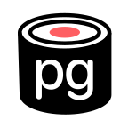
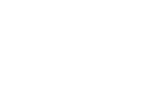

## Logos

Our logo combines a symbol and wordmark. Use the base logo and wordmark whenever possible. For dark backgrounds, use the inverted (white) logo, and for light backgrounds, use the black logo. Maintain the logo's aspect ratio, provide clear space, and avoid unauthorized modifications. In contexts with other logos, opt for the monochrome versions to ensure a cohesive and community-oriented brand identity.

| Symbol                                                | Wordmark                                                    |
|-------------------------------------------------------|-------------------------------------------------------------|
|    |    |
|  |  |
|  |  |

## Banner

The project banner is a key branding element that can be prominently featured at the top of project documentation, websites, social media profiles, and even on swag stickers. It serves as a visual representation of our project's identity and can be used to create a strong connection with our brand. Ensure that the banner is displayed at its original size to maintain clarity and visibility across various applications.

